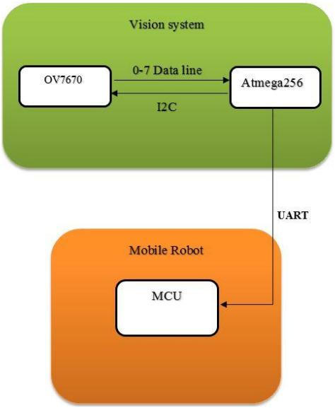

# Machine Vision Sensor (MVS) for Robotics

`Revision 1.0 (2017-03-01)`

## Preamble

1. Contains the documentation and firmware for Machine Vision Sensor deployed on two wheel self-balancing robot.

## Summary

1. Project Summery
2. Image Processing
3. Deploy Machine Vision Sensor (MVS)

## 1. Project Summery

In this project embedded low cost CMOS vision sensor is developed base on simple microcontroller. The vision sensor consist of two main parts, camera and microcontroller. OV7670 CMOS camera has been chosen for this
project for image accusation and Atmega 2560 microcontroller selected for camera interfacing and image processing. Camera capture image and transfer to MCU for processing and based on the proposed protocol for the robot for communication and controlling, the vision sensor send command to the robot base on the data gained from the camera.
[Camera module](https://www.amazon.ca/640x480-Camera-Module-OV7670-Quality/dp/B00KBPQ13E) and [Robot](https://www.tindie.com/products/yaqoob/assembled-self-balancing-two-wheels-mobile-robot/) used in this project.

## 2. Image Processing

- Light Intensity Tracking
- Edge Detection
- Object Tracking

## 3. Deploy MVS

The OV7670 pinouts to Arduino Mega 2560

| Pin   | Type         | Description |
| ----- | ------------ | ------------ |
| 3V3   | Power        | To Arduino 3.3V |
| GND   | Power        | To Ground |
| SIOD  | Input/Output | 2C interface connection to the Arduino’s SDA data line |
| SIOC  | Input        | I2C interface connection to the Arduino’s SCL clock line |
| VSYNC | Output       | Output from camera that marks the start or stop of an output of a single image frame |
| HREF  | Output       | True if a row of an image is being output to the video port |
| D0-7  | Output       | Data output port, 1 byte or 8 bits wide. Image data is read from these pins one byte at a time |
| RST   | Input        | It can be used to reset the camera |
| PWDN  | Input        | It used to put the camera into power down mode |
| STR   | Output       | Camera strobe output that can be used to turn on an LED light while the camera takes an image |
| RCK   | Input        | Clock pulse that is used to read in data from the data port one byte at a time. One clock cycle corresponding to one byte |
| OE    | Input        | Controls the camera’s output enable for the data port that is used to determine if the data on the pins D7 – D0 are valid |
| WR    | Input        | Write enable input for enabling the writing of data to the camera’s frame buffer memory. True if you want image data from the camera to be written to the FIFO frame buffer memory. False if the image data is not to be written to the camera’s memory |
| RRST  | Input        | Reset the frame buffer memory’s read pointer so that image data is read and sent to the video output port starting at the beginning of the image or frame |
| WRST  | Input        | Reset the frame buffer memory’s write pointer so that image data will be written at the start of the image or frame |

Robot communication protocol

| Master       | Slave (robot) | Remarks |
| -----------  | :----: | ----------- |
| [‘a’]+[X]    | -      | Beep a tone, X = 1 to 15, 1 corresponds to lowest pitch, and 15 to the highest pitch. |
| [‘x’]+[*]    | -      | Stop the robot if it is moving. |
| [‘f’]+[X]    | -      | Move forward, value of X sets the speed.X = 0, slow.   X = 1, normal.  X > 1, fast. |
| [‘t’]+[X]    | -      | Move backward, value of X sets the speed.X = 0, slow.  X = 1, normal.  X > 1, fast. |
| [‘l’]+[X]    | -      | Turn left, X sets the angle of turn. Valid value for X range from 1 to 180. |
| [‘r’]+[X]    | -      | Turn right, X sets the angle of turn. Valid value for X range from 1 to 180. |
| [‘c’]+[*]    | -      | Continuous turn left. |
| [‘C’]+[*]    | -      | Continuous turn right. |
| [‘S’]+[*]    | IR sensor value, 0 to 255 | Send IR distance sensor output to master. |

[ ] – Denotes a byte (8-bits unsigned).

‘a’ – Denotes the ASCII value of character a
[3] + [5] – Denotes sending two bytes, first byte has a value of 3, and second byte a value of 5.

[*] – Don’t care, the value in this byte is not used, can just set it to 0.
## 4. To Do

- [ ] Edge Detection
- [ ] Object Tracking

## 5. Reference

<a id="1">[1]</a>
Chin, R.  (2015).
Beginning Arduino Ov7670 Camera Development, 9781512357981, CreateSpace Independent Publishing Platform.
[Beginning Arduino Ov7670 Camera Development](https://g.co/kgs/zLRLjr)

<a id="2">[2]</a>
[OV7670 datasheet.](http://web.mit.edu/6.111/www/f2016/tools/OV7670_2006.pdf)

<a id="2">[3]</a>
[OV7670 Modeling and Control of Two-Wheels Self Balancing (TWSB) Robot.](https://fkeng.blogspot.com/2019/03/theory-and-design-of-two-wheels-self.html)
